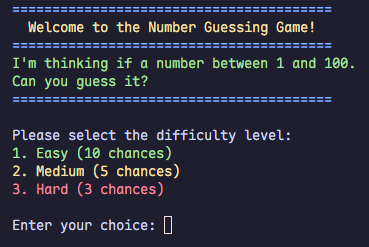
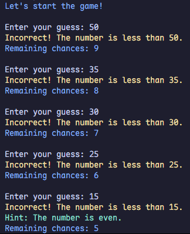
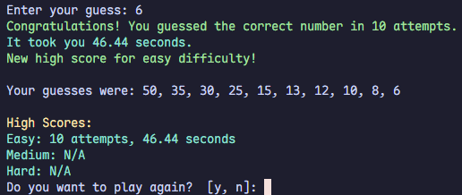
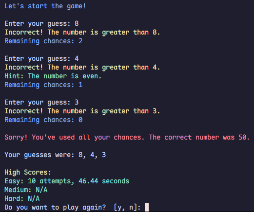
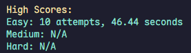
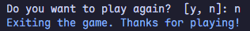

# Number Guessing Game CLI

A simple command-line number guessing game where players try to guess a randomly generated number within a limited number of attempts. The game includes multiple difficulty levels, high score tracking, and hints to make the experience more engaging.

This project is inspired by the [Number Guessing Game project](https://roadmap.sh/projects/number-guessing-game) from roadmap.sh.

## Features

- **Difficulty Levels**: Choose between Easy, Medium, and Hard modes.
- **Hints**: Get a clue about whether the number is even or odd after a few incorrect guesses.
- **High Scores**: Tracks the best scores for each difficulty level based on attempts and time taken.
- **Replay Option**: Play as many times as you like.

## How to Play

1. Run the game in your terminal using PHP.
2. Select a difficulty level:
   - Easy: 10 chances
   - Medium: 5 chances
   - Hard: 3 chances
3. Guess the number between 1 and 100.
4. Receive feedback on whether your guess is too high or too low.
5. Try to guess the number within the allowed chances.

## Example Gameplay

### Starting the Game

### Making Guesses

### Winning the Game

### Losing the Game

### High Scores

### Replay Option

## Requirements

- PHP 7.4 or higher
- Terminal or command-line interface

## How to Run

1. Clone this repository:
2. Run the game:
3. Enjoy the game!